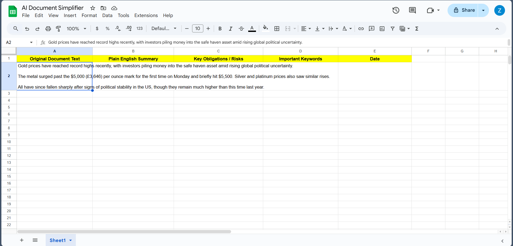
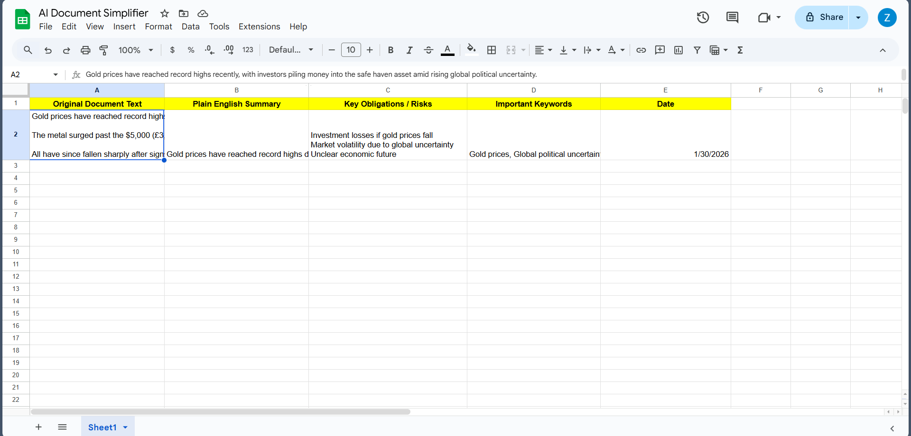
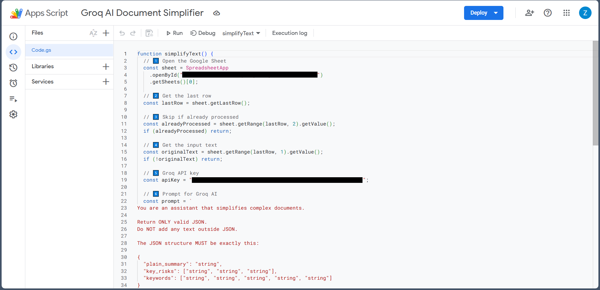

# AI Document Simplifier

AI-powered Google Sheets automation that simplifies complex documents into plain English, extracts key obligations or risks, and generates relevant keywords.

---

## Overview
AI Document Simplifier helps users quickly understand technical, legal, or policy documents by converting unstructured text into clear and structured insights. The system is designed to reduce cognitive load and make important information easier to identify and reuse.

---

## Features
- Accepts technical or legal text as input  
- Generates a plain English summary  
- Extracts key obligations and risks  
- Identifies important keywords  
- Automatically stores results with date in Google Sheets  

---

## Tech Stack
- Google Apps Script  
- Groq LLM API  
- Google Sheets  

---

## Screenshots

### Input

### Output

### Code

